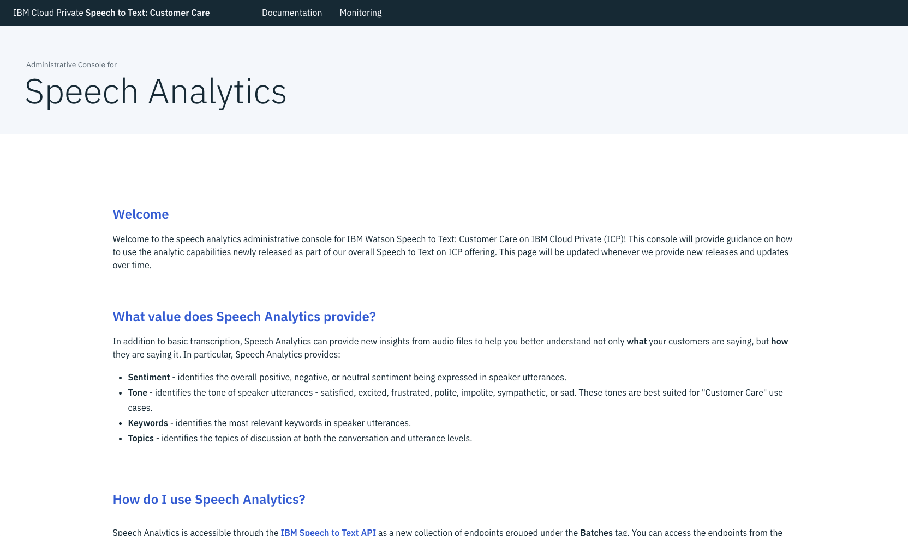
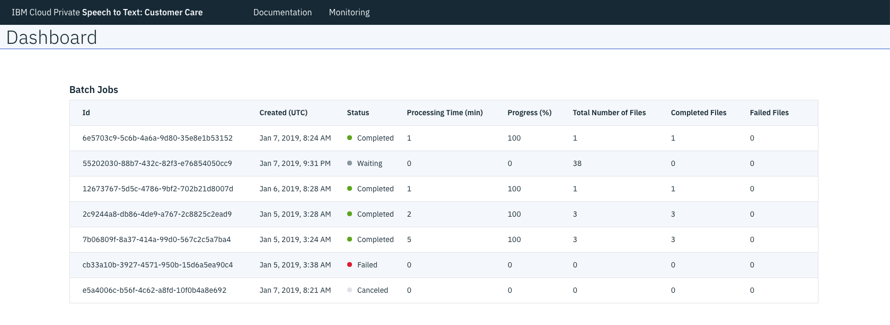

---

copyright:
  years: 2019
lastupdated: "2019-03-07"

subcollection: speech-to-text-icp

---

{:shortdesc: .shortdesc}
{:new_window: target="_blank"}
{:tip: .tip}
{:important: .important}
{:note: .note}
{:deprecated: .deprecated}
{:pre: .pre}
{:codeblock: .codeblock}
{:screen: .screen}
{:javascript: .ph data-hd-programlang='javascript'}
{:java: .ph data-hd-programlang='java'}
{:python: .ph data-hd-programlang='python'}
{:swift: .ph data-hd-programlang='swift'}

# The batch-processing HTTP interface
{: #batch}

The batch-processing HTTP interface of {{site.data.keyword.ibmwatson}} {{site.data.keyword.speechtotextshort}}: Customer Care provides methods for performing speech recognition on collections of multiple audio files. Instead of passing audio files with a request, you store the files in an input bucket in a Cloud Object Storage (COS) server. Similarly, instead of returning results in its response to the request, the service writes the results to an output bucket in the COS server.
{: shortdesc}

You can use the batch-processing interface for speech recognition just as you would the service's WebSocket and other HTTP interfaces. The batch-processing interface accepts many of the parameters that are available with the other interfaces. The following sections describe how to use the interface for speech recognition.

You can also use the interface to obtain speech analytics for the conversations and speakers from audio files. To produce speech analytics, the service further analyzes its speech recognition results to generate detailed information about the topics of overall conversation and the tone, sentiment, keywords, and topics of individual speakers. For more information, see [Speech analytics](/docs/services/speech-to-text-icp/analytics.html).

For more information about the individual methods of the interface, see the [API reference ](https://{DomainName}/apidocs/speech-to-text-icp){: new_window}.

Batch processing and speech analytics consume extra processing resources. Consider deploying more Virtual Processor Cores (VPCs) if you use these features. For more information, see [Installing and configuring the service](/docs/services/speech-to-text-icp/install-config.html). Batch processing and speech analytics are supported only for US English audio at this time.
{: important}

## How batch-processing works
{: #batchWorkflow}

The service performs batch-processing in a series of stages. The service attempts to scan and process each input audio file in the input bucket. The service never modifies an input file. It populates the output bucket with at least one new file for each input file that it finds in the input bucket.

-   If the service can successfully process the input file, the corresponding output file has the same name as the input file with a **.json** extension. The output file contains the results that are returned for a successful speech recognition request.
-   If the service cannot process the input file, the corresponding output file has the same name as the input file with a **.notice** extension. The output file contains the error response that is returned for an unsuccessful speech recognition request.

Because the service processes files in stages, it can produce both **.json** and **.notice** files for the same input file. Once it produces a **.notice** file for an input file, it produces no further results for that file.

When the service writes a **.json** or **.notice** file to the output bucket, it overwrites a file of the same name if one already exists. If it writes a **.json** file to the output bucket and a **.notice** file already exists for the input file from a previous job, the service does not remove the **.notice** file. The same is true if a **.json** file already exists when the service writes a **.notice** file to the output bucket.

To avoid confusion, remove all output files and, if you use separate input and output buckets, directories from a previous job before you submit a new request. The output files from previous requests can make it difficult to correctly interpret the results for subsequent requests.
{: tip}

## Usage model
{: #batchUsage}

To use the batch-processing interface, perform the following steps:

1.  Create your Cloud Object Storage input and output buckets. For more information, see [Using Cloud Object Storage](#batchCOS).
1.  Populate your input bucket with the audio files that you want the service to process. For more information, see [Providing audio files](#batchAudio).
1.  Create a batch-processing job to submit the audio files for speech recognition. For more information, see [Creating a batch job](#batchCreate).
1.  Monitor the progress of the batch job until it completes. You can check the status of a batch job in one of two ways:
    -   By making API calls with the batch-processing interface. For more information, see [Checking job status with the API](#batchCheckAPI).
    -   By using the {{site.data.keyword.speechtotextshort}} Admin Console GUI. For more information, see [Checking job status with the GUI](#batchCheckGUI).
1.  Examine the speech recognition results by reading the files in the output bucket. For more information, see [Understanding the results of a batch job](#batchResults).

The batch-processing interface also provides methods for [Canceling a batch job](#batchCancel) and [Deleting a batch job](#batchDelete).

## Using Cloud Object Storage
{: #batchCOS}

Batch processing requires the use of a Cloud Object Storage (COS) server. COS manages the input bucket from which the service reads audio files and the output bucket to which it writes results. You can specify distinct input and output buckets, or you can use a single bucket for both input and output.

-   You must provide the location, name, and credentials for an input bucket.
-   You can optionally provide the location, name, and credentials for an output bucket. If you omit this information, the service uses the input bucket for both input and output.

For more information about specifying the COS buckets with a batch-processing request, see [COS parameters](#batchCreateCOS).

### Supported COS servers
{: #batchCOSServers}

The {{site.data.keyword.speechtotextshort}}: Customer Care service supports the use of any COS server that is compatible with Amazon S3 (Simple Storage Service). For more information, see [Amazon S3 ](https://aws.amazon.com/s3/){: new_window}.

For example, you can use either of the following COS servers:

-   The Minio Cloud Object Storage server that comes with {{site.data.keyword.cloud}} Private. For more information, see [Minio ](https://www.ibm.com/support/knowledgecenter/SSBS6K_3.1.0/manage_cluster/minio.html){: new_window} in the {{site.data.keyword.cloud_notm}} Private documentation and [Minio Private Cloud Storage ](https://minio.io/){: new_window}.
-   The {{site.data.keyword.cos_full}} server. For more information, see [About {{site.data.keyword.cos_full}} ](https://cloud.ibm.com/docs/services/cloud-object-storage/about-cos.html){: new_window}.

### COS credentials
{: #batchCOSCredentials}

You must provide credentials for the input and output buckets that you use in your COS server. If you use the same bucket for both input and output, you need to provide the credentials only once. The credentials must have `READ` permission on the input bucket and both `READ` and `WRITE` permissions on the output bucket.

The service supports two formats for passing credentials files with a batch-processing request.

#### Amazon S3-compatible credentials format
{: #batchCOSCredentialsS3}

Amazon S3-compatible COS servers use the following credentials format. The Minio server uses this format.

```javascript
{
  "end_point": "{end_point}",
  "access_key": "{access_key}",
  "secret_key": "{secret_key}"
}
```
{: codeblock}

The fields provide the following information:

-   `end_point` is the URL for your COS server, for example, `https://s3-api.dal-us-geo.objectstorage.softlayer.net` for a Minio server.
-   `access_key` and `secret_key` are a key pair that you use to authenticate to your COS server.

The following is an example of a credentials file for a Minio server:

```javascript
{
  "end_point": "https://us-geo.objectstorage.softlayer.net",
  "access_key": "946355e2771903728f16934b6ca9ff31",
  "secret_key": "83949c7aed5b693641eb76a8985cd99062381425367018b5"
}
```
{: codeblock}

For more information, see [Minio Docker Quickstart Guide ](https://docs.minio.io/docs/minio-docker-quickstart-guide.html){: new_window} and [Understanding and Getting Your Security Credentials ](https://docs.aws.amazon.com/general/latest/gr/aws-sec-cred-types.html){: new_window} in the Amazon Web Services documentation.

#### {{site.data.keyword.cloud_notm}} Object Storage credentials format
{: #batchCOSCredentialsIBM}

The {{site.data.keyword.cos_full}} server uses the Identity and Access Management (IAM) credentials format.

```javascript
{
  "apikey": "{apikey}",
  "end_point": "{end_point}",
  "resource_instance_id": "{instance_id}",
  "region": "{region}"
}
```
{: codeblock}

The fields provide the following information:

-   `apikey` is the API key from your {{site.data.keyword.cloud_notm}} credentials.
-   `end_point` and `region` are values from [https://cos-service.bluemix.net/endpoints ](https://cos-service.bluemix.net/endpoints){: new_window}, for example, `https://s3.us-south.objectstorage.softlayer.net` and `us-south`.
-   `instance_id` is a value from your {{site.data.keyword.cloud_notm}} resource instance ID. For example, from the following resource instance ID in your credentials:

    ```javascript
    "resource_instance_id": "crn:v1:bluemix:public:cloud-object-storage:global:a/5b8a4a9c3308b0d2f73f5e8e468f0a11:ec21da8a-b15c-42bd-8ca7-a9d4230107c9::"
    ```
    {: codeblock}

    Use the string that lies between the last single colon and the trailing pair of colons:

    ```javascript
    ec21da8a-b15c-42bd-8ca7-a9d4230107c9
    ```
    {: codeblock}

The following is an example of a credentials file for an {{site.data.keyword.cos_full}} server:

```javascript
{
  "apikey": "Huw5KLD1Qlg6a8ftrk8MGhSpLfd73gqcOYb3Dpi6fWzF",
  "end_point": "https://s3.us-south.objectstorage.softlayer.net",
  "resource_instance_id": "ec21da8a-b15c-42bd-8ca7-a9d4230107c9",
  "region": "us-south"
}
```
{: codeblock}

For more information, see [Service credentials ](https://cloud.ibm.com/docs/services/cloud-object-storage/iam/service-credentials.html#service-credentials){: new_window} and [Select regions and endpoints ](https://cloud.ibm.com/docs/services/cloud-object-storage/basics/endpoints.html#select-regions-and-endpoints){: new_window} in the {{site.data.keyword.cos_full}} documentation.

## Providing audio files
{: #batchAudio}

Once you have an input bucket, the next step is to populate the bucket with the audio files that you want the service to process. You can copy all of the files to the root directory of the bucket, or you can create a hierarchy of directories to contain the files.

If you specify different input and output buckets, the service duplicates the directory structure of the input bucket when it writes its results to the output bucket. If the input files are organized into a hierarchy of directories, the service organizes the output files into the same directory structure. If you use the same bucket for input and output, the service writes each output file to the same directory as its input file.

Each audio file can have a maximum of 100 MB and a minimum of 100 bytes of audio data. The service imposes no limits on the cumulative size of all audio files or on the number of files that you can submit for batch processing. However, submitting large amounts of audio can greatly increase the processing time, and using speech analytics consumes additional processing resources. {{site.data.keyword.IBM}} recommends that you install more VPCs to use the batch-processing and speech analytics features. For more information, see [Installing and configuring the service](/docs/services/speech-to-text-icp/install-config.html).

### Supported audio formats
{: #batchAudioSupported}

With batch-processing, you can submit only input files whose audio format (MIME type) and characteristics (such as sampling rate) the service can derive. The input files do not need to have the same audio format. The service accepts the following audio formats:

-   `audio/flac`
-   `audio/g729` (Use only with narrowband models.)
-   `audio/mp3`
-   `audio/mpeg`
-   `audio/ogg` (The service automatically detects the codec of the input audio.)
-   `audio/ogg;codecs=opus`
-   `audio/ogg;codecs=vorbis`
-   `audio/wav` (Provide audio with a maximum of nine channels.)
-   `audio/webm` (The service automatically detects the codec of the input audio.)
-   `audio/webm;codecs=opus`
-   `audio/webm;codecs=vorbis`

You cannot submit input audio files with the following formats because they require additional parameters to identify aspects of their formats:

-   `audio/basic`
-   `audio/l16`
-   `audio/mulaw`

For more information about all audio formats that the service supports, see [Audio formats](/docs/services/speech-to-text-icp/audio-formats.html).

## Creating a batch job
{: #batchCreate}

You create a batch-processing job by calling the `POST /v1/batches` method. The method includes the following parameters:

-   The required `function` query parameter specifies the operation that the service is to perform on the files in the input bucket. Currently, the only supported operation is `recognize`, which directs the service to perform speech recognition.
-   The [COS parameters](#batchCreateCOS) specify information about the input bucket and, optionally, the output bucket.
-   The [speech recognition parameters](#batchCreateRecognition) specify additional input and output parameters. Input parameters define the language, model, and custom models for the request. Output parameters request more information about the audio or modify a transcript. All of the parameters are optional.

[Example batch-processing requests](#batchCreateExamples) shows example requests with different combinations of parameters.

### COS parameters
{: #batchCreateCOS}

When you submit a batch-processing request, you specify the credentials, location, and name for the input bucket from which the service is to read audio files and, optionally, the separate output bucket to which it is to write results. You pass the information as multipart form-data with the request by setting the `Content-Type` request header to `multipart/form-data`.

The following table describes the COS parameters that you use to create a batch-processing request. As described in [Using Cloud Object Storage](#batchCOS), you can use the same bucket for both input and output. To use a single bucket, omit the <code>output_credentials_file</code>, <code>output_bucket_location</code>, and <code>output_bucket_name</code> parameters. In this case, at a minimum the <code>input_bucket_credentials</code> must enable both <code>READ</code> and <code>WRITE</code> permissions on the input bucket.

<table>
  <caption>Table 1. Cloud Object Storage parameters</caption>
  <tr>
    <th style="width:25%; text-align:left">Parameter</th>
    <th style="width:15%; text-align:center">Data type</th>
    <th style="text-align:left">Description</th>
  </tr>
  <tr>
    <td style="text-align:left"><code>input_credentials_file</code><br/>
      <em>Required</em></td>
    <td style="text-align:center">File</td>
    <td style="text-align:left">
      A JSON text file that contains the COS credentials for the input
      bucket. At a minimum, the credentials must enable <code>READ</code>
      permission on the bucket that is defined by the
      <code>input_bucket_name</code> parameter.
    </td>
  </tr>
  <tr>
    <td style="text-align:left"><code>input_bucket_location</code><br/>
      <em>Required</em></td>
    <td style="text-align:center">String</td>
    <td style="text-align:left">
      The geographical location of the COS input bucket as listed on the
      <strong>Endpoint</strong> tab of your COS instance; for example,
      <code>us-geo</code>, <code>eu-geo</code>, or <code>ap-geo</code>.
    </td>
  </tr>
  <tr>
    <td style="text-align:left"><code>input_bucket_name</code><br/>
      <em>Required</em></td>
    <td style="text-align:center">String</td>
    <td style="text-align:left">
      The user-defined name of the COS input bucket.
    </td>
  </tr>
  <tr>
    <td style="text-align:left"><code>output_credentials_file</code><br/>
      <em>Optional</em></td>
    <td style="text-align:center">File</td>
    <td style="text-align:left">
      A JSON text file that contains the COS credentials for the output
      bucket. At a minimum, the credentials must enable <code>READ</code>
      and <code>WRITE</code> permissions on the bucket that is defined by
      the <code>output_bucket_name</code> parameter.
    </td>
  </tr>
  <tr>
    <td style="text-align:left"><code>output_bucket_location</code><br/>
      <em>Optional</em></td>
    <td style="text-align:center">String</td>
    <td style="text-align:left">
      The geographical location of the COS output bucket as listed on the
      <strong>Endpoint</strong> tab of your COS instance; for example,
      <code>us-geo</code>, <code>eu-geo</code>, or <code>ap-geo</code>.
    </td>
  </tr>
  <tr>
    <td style="text-align:left"><code>output_bucket_name</code><br/>
      <em>Optional</em></td>
    <td style="text-align:center">String</td>
    <td style="text-align:left">
      The user-defined name of the COS output bucket.
    </td>
  </tr>
</table>

### Speech recognition parameters
{: #batchCreateRecognition}

The batch-processing interface currently supports only a subset of the available speech recognition parameters. The following table describes the parameters that you can use for speech recognition. All of the parameters are optional.

<table>
  <caption>Table 2. Speech recognition parameters that you can specify</caption>
  <tr>
    <th style="width:25%; text-align:left">Parameter</th>
    <th style="width:15%; text-align:center">Data type</th>
    <th style="text-align:left">Description</th>
  </tr>
  <tr>
    <td style="text-align:left"><code>acoustic_customization_id</code></td>
    <td style="text-align:center">String</td>
    <td style="text-align:left">
      A custom acoustic model that is to be used for speech recognition.
      For more information, see
      [Custom models](/docs/services/speech-to-text-icp/input.html#custom).
    </td>
  </tr>
  <tr>
    <td style="text-align:left"><code>customization_weight</code></td>
    <td style="text-align:center">Double</td>
    <td style="text-align:left">
      A relative weight between 0.0 and 1.0 that the service is to give
      to words from a custom language model. For more information, see
      [Custom models](/docs/services/speech-to-text-icp/input.html#custom).
    </td>
  </tr>
  <tr>
    <td style="text-align:left"><code>language_customization_id</code></td>
    <td style="text-align:center">String</td>
    <td style="text-align:left">
      A custom language model that is to be used for speech recognition.
      For more information, see
      [Custom models](/docs/services/speech-to-text-icp/input.html#custom).
    </td>
  </tr>
  <tr>
    <td style="text-align:left"><code>model</code></td>
    <td style="text-align:center">String</td>
    <td style="text-align:left">
      The language and model that are to be used for speech recognition.
      The service currently supports only US English audio with the
      batch-processing interface, so you can specify only
      `en-US_BroadbandModel` (the default), `en-US_NarrowbandModel`, or
      `en-US_ShortForm_NarrowbandModel`. For more information, see
      [Languages and models](/docs/services/speech-to-text-icp/models.html).
    </td>
  </tr>
  <tr>
    <td style="text-align:left"><code>profanity_filter</code></td>
    <td style="text-align:center">Boolean</td>
    <td style="text-align:left">
      Censors profanity from US English transcripts. For more information, see
      [Profanity filtering](/docs/services/speech-to-text-icp/output.html#profanity_filter).
    </td>
  </tr>
  <tr>
    <td style="text-align:left"><code>redaction</code></td>
    <td style="text-align:center">Boolean</td>
    <td style="text-align:left">
      Redacts numeric data from US English, Japanese, and Korean transcripts.
      For more information, see
      [Numeric redaction](/docs/services/speech-to-text-icp/output.html#redaction).
    </td>
  </tr>
  <tr>
    <td style="text-align:left"><code>smart_formatting</code></td>
    <td style="text-align:center">Boolean</td>
    <td style="text-align:left">
      Converts dates, times, numbers, currency, and similar values into
      more conventional representations in US English, Japanese, and
      Spanish transcripts. For more information, see
      [Smart formatting](/docs/services/speech-to-text-icp/output.html#smart_formatting).
    </td>
  </tr>
  <tr>
    <td style="text-align:left"><code>word_confidence</code></td>
    <td style="text-align:center">Boolean</td>
    <td style="text-align:left">
      Returns confidence scores for the words of the transcript.
      For more information, see
      [Word confidence](/docs/services/speech-to-text-icp/output.html#word_confidence).
    </td>
  </tr>
</table>

The service always uses a value of `true` for the following parameters, regardless of whether you specify or omit them.

<table>
  <caption>Table 3. Speech recognition parameters that are always enabled</caption>
  <tr>
    <th style="width:25%; text-align:left">Parameter</th>
    <th style="width:15%; text-align:center">Data type</th>
    <th style="text-align:left">Description</th>
  </tr>
  <tr>
    <td style="text-align:left"><code>timestamps</code></td>
    <td style="text-align:center">Boolean</td>
    <td style="text-align:left">
      Produces timestamps (start and end times) for all words of the audio.
      For more information, see
      [Word timestamps](/docs/services/speech-to-text-icp/output.html#word_timestamps).
    </td>
  </tr>
  <tr>
    <td style="text-align:left"><code>speaker_labels</code></td>
    <td style="text-align:center">Boolean</td>
    <td style="text-align:left">
      Identifies which individuals spoke which words in a multi-participant
      exchange for US English, Japanese, and Spanish transcripts. For more
      information, see
      [Speaker labels](/docs/services/speech-to-text-icp/output.html#speaker_labels).
    </td>
  </tr>
</table>

The service uses the default values for all other speech recognition parameters, regardless of whether you include them with a request. For more information about all speech recognition parameters, see the [Parameter summary](/docs/services/speech-to-text-icp/summary.html).

### Example batch-processing requests
{: #batchCreateExamples}

The first example creates a batch-processing job that uses different COS buckets, `my_cos_input_bucket` and `my_cos_output_bucket`, for input and output. The example passes the same COS credentials file for the input and output buckets. The credentials have the required permissions for the two buckets, both of which are located in the US geography.

The example requests default speech recognition, with no additional speech recognition parameters. It passes only the required `function` query parameter.

```bash
curl -X POST -u "apikey:{apikey}"
--header "Content-Type: multipart/form-data"
--form input_credentials_file=@{path}my_cos_credentials.json
--form input_bucket_location=us-geo
--form input_bucket_name=my_cos_input_bucket
--form output_credentials_file=@{path}my_cos_credentials.json'
--form output_bucket_location=us-geo
--form output_bucket_name=my_cos_output_bucket
"https://{icp_cluster_host}{:port}/speech-to-text/api/v1/batches?function=recognize"
```
{: pre}

The second example creates a job that uses the same COS bucket, `my_cos_bucket`, for input and output. The example passes a single COS credentials file that has both `READ` and `WRITE` permissions on the specified bucket, which again resides in the US geography.

In addition to the required `function` parameter, the request passes two speech recognition parameters. It sets the `smart_formatting` parameter to `true` to convert various aspects of the transcript to more readable representations. And it sets the `redaction` parameter to mask numeric data in the transcript.

```bash
curl -X POST -u "apikey:{apikey}"
--header "Content-Type: multipart/form-data"
--form input_credentials_file=@{path}my_cos_credentials.json
--form input_bucket_location=us-geo
--form input_bucket_name=my_cos_bucket
"https://{icp_cluster_host}{:port}/speech-to-text/api/v1/batches?function=recognize&smart_formatting=true&redaction=true"
```
{: pre}

For both of these successful requests, the service returns a 200 status code and a JSON response with information about the batch job, including its batch ID. The information matches the results of a request to check the status of a job. For more information, see [Checking the status with the API](#batchCheckAPI).

## Checking job status with the API
{: #batchCheckAPI}

The batch-processing interface provides two methods for checking job status:

-   The `GET /v1/batches` method returns information about all jobs.
-   The `GET /v1/batches/(batch_id}` method returns information about a specified job.

Both methods return the following information about a batch-processing job:

-   `batch_id` is the unique identifier of the job, which you use in all requests for the job.
-   `function` identifies the requested operation, which is currently always `recognize`.
-   `input_bucket_location` and `input_bucket_name` provide information about the COS input bucket.
-   `output_bucket_location` and `output_bucket_name` provide information about the COS output bucket.
-   `total_count` is the total number of audio files that the service found in the input bucket.
-   `successful_count` is the total number of audio files that the service successfully processed. The count remains zero until the service begins to process the job. The service generates a **.json** file for each audio file that it successfully processes.
-   `failed_count` is the total number of audio files that the service failed to process. The service generates a **.notice** file for each audio file that it fails to process.
-   `created`, `updated`, and `finished` are the date and time in Coordinated Universal Time (UTC) at which the job was created, last updated, and completed. The service returns the `finished` field only for completed jobs.
-   `progress` reports the service's current progress in processing the job. The value ranges from `0.0` (the service has not started the job) to `1.0` (the service has finished the job). The field is applicable only for an active job, not for a job that has failed or been canceled. Because the service performs batch processing in stages, the field does not necessarily reflect the number of successful and failed files divided by the total file count.

The service also returns a `status` field that provides the current state of the job:

-   `initializing` - The service is scanning the input bucket to determine the audio files to process.
-   `waiting` - The service is waiting to run the job, which is initialized and queued for processing.
-   `running` - The service is currently processing the job.
-   `completed` - The service has finished processing the job.
-   `canceled` - The user canceled the job by using the `PUT /v1/batches/{batch_id}` method.
-   `failed` - The service could not initialize or run the job.

If the status is `failed`, the output includes an `error_message` field that describes the cause of the failure. The problem occurred at the level of the overall request. A problem with an input file cannot cause a request to fail; it can only increment the `failed_count` field for the job.

The `GET /v1/batches` method continues to return the status of a job until the job is deleted. Once a job is complete, it is a good idea to delete it to minimize the amount of output that the method returns. For more information, see [Deleting a batch job](#batchDelete).
{: tip}

### Example requests and responses
{: #batchCheckAPIExamples}

The following example checks the status of all batch-processing jobs:

```bash
curl -X GET -u "apikey:{apikey}"
"https://{icp_cluster_host}{:port}/speech-to-text/api/v1/batches"
```
{: pre}

Two batch jobs currently exist. The service is initializing the most recent job, which includes 10 audio files. The older job includes eight audio files. The service is currently half done with the running job. It has processed three of the eight files successfully; one file has failed.

```javascript
{
  "jobs": [
    {
      "function": "recognize",
      "input_bucket_location": "us-geo",
      "input_bucket_name": "my_cos_bucket",
      "output_bucket_location": "us-geo",
      "output_bucket_name": "my_cos_bucket",
      "batch_id": "6829a370-c214-b219-8223-890a109a7644",
      "total_count": 10,
      "successful_count": 0,
      "failed_count": 0,
      "status": "initializing",
      "progress": 0.0,
      "created": "2018-12-30T11:33:29.912+0000",
      "updated": "2018-12-30T11:33:29.912+0000"
    },
    {
      "function": "recognize",
      "input_bucket_location": "us-geo",
      "input_bucket_name": "my_cos_input_bucket",
      "output_bucket_location": "us-geo",
      "output_bucket_name": "my_cos_output_bucket",
      "batch_id": "65698e79-d601-4d8f-b46d-dd1369020b58",
      "total_count": 8,
      "successful_count": 3,
      "failed_count": 1,
      "status": "running",
      "progress": 0.5,
      "created": "2018-12-30T11:30:55.627+0000",
      "updated": "2018-12-30T11:31:14.031+0000"
    }
  ]
}
```
{: codeblock}

The following example checks the status of the batch-processing job that has the specified ID:

```bash
curl -X GET -u "apikey:{apikey}"
"https://{icp_cluster_host}{:port}/speech-to-text/api/v1/batches/65698e79-d601-4d8f-b46d-dd1369020b58"
```
{: pre}

```javascript
{
  "function": "recognize",
  "input_bucket_location": "us-geo",
  "input_bucket_name": "my_cos_input_bucket",
  "output_bucket_location": "us-geo",
  "output_bucket_name": "my_cos_output_bucket",
  "batch_id": "65698e79-d601-4d8f-b46d-dd1369020b58",
  "total_count": 8,
  "successful_count": 3,
  "failed_count": 1,
  "status": "running",
  "progress": 0.5,
  "created": "2018-12-30T11:30:55.627+0000",
  "updated": "2018-12-30T11:31:14.031+0000"
}
```
{: codeblock}

## Checking job status with the GUI
{: #batchCheckGUI}

You can check the status of all batch jobs by using the {{site.data.keyword.speechtotextshort}} Admin Console GUI that is provided for batch processing and speech analytics. The GUI is a convenient way to monitor the progress of your batch jobs.

The Admin Console GUI has two tabs:

-   The `Documentation` tab provides an overview of batch-processing and speech analytics, along with information about the interface.

    

-   The `Monitoring` tab shows complete status information for all outstanding batch jobs. Batch jobs with many files can take a while to complete, especially if speech analytics output is also requested. To get the latest status, refresh the browser page in which the GUI is running.

    The GUI greatly simplifies the monitoring of active jobs. The following example shows the status of seven batch jobs. Most of the jobs are complete. One job has failed, and another is waiting to start.

    

Like the API, the Admin Console GUI continues to report the status of a job until it is deleted. Once a job is complete, it is a good idea to delete it to simplify the output. For more information, see [Deleting a batch job](#batchDelete).
{: tip}

### Launching the GUI
{: #batchCheckGUILaunch}

To start the {{site.data.keyword.speechtotextshort}} Admin Console GUI, follow these steps:

1.  Log in to the **ICP Admin Console**.
2.  Open the side menu and expand the **Workloads** menu item.
3.  Select **Deployments**.
4.  In the **Deployments** table, locate the row for `{release-name}-speech-to-text-speech-analytics-ui`, where `release-name` is the name of your local deployment.
5.  Click the **Launch** button at the end of that row.

The Admin Console GUI opens in a tab of the browser.

## Understanding the results of a batch job
{: #batchResults}

When you use the batch-processing interface for speech recognition alone, without speech analytics, the results are similar to those of any of the service's other speech recognition interfaces. The primary differences concern how the service provides its results and the scope of the output.

-   The service reports separate results for each input audio file. For each input file that it successfully processes, the service produces an output file that has the same name as the audio file with the addition of a **.json** extension.
    -   If you use the same COS bucket for both input and output, the **.json** file resides in the same bucket and directory as the input file.
    -   If you use different COS buckets for input and output, the service duplicates the directory structure of the input bucket in the output bucket. The **.json** file resides in a directory of the output bucket that has the same relative path name as the audio file in the input bucket.
-   For any input file that it fails to process, the service produces an output file with the same name as the audio file with the addition of a **.notice** extension. The service writes the file to the same bucket and directory that it would a **.json** file. As mentioned previously, the service can produce both **.json** and **.notice** files for an audio file that passes earlier stages of processing but fails a later stage.
-   The results reflect the input parameters, such as custom models, that you used with the request. They also reflect any supported output parameters that you passed with the request.
-   Because the interface supports only a subset of the parameters that are available with the service's other speech recognition interfaces, the scope of the output is more limited. For example, when you use the batch-processing interface, you cannot direct the service to use a grammar or to spot keywords in the audio.
-   Because the interface always sets the `timestamps` and `speaker_labels` parameters to `true`, the results always include the start and end time of each word of the audio and always identify which individuals spoke which words. The interface also inserts a copy of the appropriate speaker labels object into each element of the timestamps information.

The differences noted for speech recognition parameters in the last two bullets will be addressed in a future release. Otherwise, the results are the same as those for any transcription request. The service returns all JSON response content in the UTF-8 character set. For more information, see [Understanding recognition results](/docs/services/speech-to-text-icp/basic-response.html).

### Example output file
{: #batchResultsExample}

The following example shows the output for a brief audio file, <a target="_blank" href="https://watson-developer-cloud.github.io/doc-tutorial-downloads/speech-to-text/audio-file.flac" download="audio-file.flac">audio-file.flac </a>. The batch-processing request uses a single COS bucket for input and output. The request includes the minimum required parameters.

```bash
curl -X POST -u "apikey:{apikey}"
--header "Content-Type: multipart/form-data"
--form input_credentials_file=@{path}my_cos_credentials.json
--form input_bucket_location=us-geo
--form input_bucket_name=my_cos_bucket
"https://{icp_cluster_host}{:port}/speech-to-text/api/v1/batches?function=recognize"
```
{: pre}

The service writes the output file to the same bucket as the input file. It names the output file **audio-file.flac.json**. Currently, the service always uses a value of `true` for the `timestamps` and `speaker_labels` parameters, so the output includes those fields. Also, the service embeds a copy of the corresponding `speaker_labels` object into each element of the `timestamps` field.

```javascript
{
  "result_index": 0,
  "speaker_labels": [
    {
      "speaker": 0,
      "confidence": 0.5,
      "final": false,
      "from": 1.01,
      "to": 1.52
    },
    {
      "speaker": 0,
      "confidence": 0.5,
      "final": false,
      "from": 1.52,
      "to": 2.15
    },
    {
      "speaker": 0,
      "confidence": 0.5,
      "final": false,
      "from": 2.15,
      "to": 2.49
    },
    . . .
    {
      "speaker": 0,
      "confidence": 0.5,
      "final": true,
      "from": 5.73,
      "to": 6.35
    }
  ],
  "results": [
    {
      "final": true,
      "alternatives": [
        {
          "transcript": "several tornadoes touch down as a line of
severe thunderstorms swept through Colorado one Sunday ",
          "timestamps": [
            [
              "several",
              1.01,
              1.52,
              {
                "speaker": 0,
                "confidence": 0.5,
                "final": false,
                "from": 1.01,
                "to": 1.52
              }
            ],
            [
              "tornadoes",
              1.52,
              2.15,
              {
                "speaker": 0,
                "confidence": 0.5,
                "final": false,
                "from": 1.52,
                "to": 2.15
              }
            ],
            [
              "touch",
              2.15,
              2.49,
              {
                "speaker": 0,
                "confidence": 0.5,
                "final": false,
                "from": 2.15,
                "to": 2.49
              }
            ],
            . . .
            [
              "Sunday",
              5.73,
              6.35,
              {
                "speaker": 0,
                "confidence": 0.5,
                "final": true,
                "from": 5.73,
                "to": 6.35
              }
            ]
          ],
          "confidence": 0.933
        }
      ]
    }
  ]
}
```
{: codeblock}

## Canceling a batch job
{: #batchCancel}

Use the `PUT /v1/batches/{batch_id}` method to cancel a batch-processing job. The method has one required query parameter, `action`, which specifies the action that the service is to take. Currently, the only supported action is `cancel`, which cancels a pending or active batch job. The service changes the job's status to `canceled`.

-   If you cancel a pending job, one whose status is `initializing` or `waiting`, the service never processes the job. For a job that is `initializing`, the service never creates an entry for the job in the processing queue. For a job that is `waiting`, the service removes the job's entry from the queue.
-   If you cancel an active job, one whose status is `running`, the service attempts to stop processing any files that it is actively working on. The service might finish processing such files, but it does not start processing any new files. Moreover, the service might have finished processing some files for the job. The results for those files remain in the output bucket.

The request has no effect if the indicated job is already finished (its status is `completed`), was canceled, or failed.

### Example request
{: #batchCancelExample}

The following example cancels the batch-processing job with the specified batch ID:

```bash
curl -X PUT -u "apikey:{apikey}"
"https://{icp_cluster_host}{:port}/speech-to-text/api/v1/batches/6829a370-c214-b219-8223-890a109a7644?action=cancel"
```
{: pre}

## Deleting a batch job
{: #batchDelete}

The service never removes its records of batch-processing jobs, so the list of jobs can grow over time. Use the `DELETE /v1/batches/{batch_id}` method to prune old batch jobs from the service's records.

-   If you delete a pending job or a job that is already finished, the service simply removes its record of the job.
-   If you delete an active job, the service cancels the job before deleting it.

The service does not delete or modify results for any job in the output bucket. If the job was active or finished, the results of the job remain in the output bucket.

### Example request
{: #batchDeleteExample}

The following example deletes the batch-processing job with the specified batch ID:

```bash
curl -X DELETE -u "apikey:{apikey}"
"https://{icp_cluster_host}{:port}/speech-to-text/api/v1/batches/6829a370-c214-b219-8223-890a109a7644"
```
{: pre}
