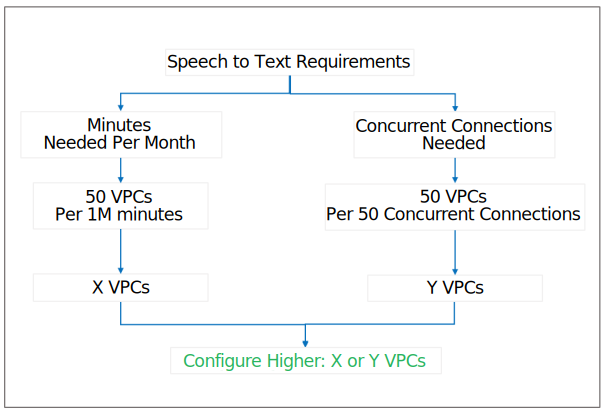

---

Copyright:
  years: 2018
lastupdated: "2018-09-20"

---

{:shortdesc: .shortdesc}
{:new_window: target="_blank"}
{:tip: .tip}
{:pre: .pre}
{:codeblock: .codeblock}
{:screen: .screen}
{:javascript: .ph data-hd-programlang='javascript'}
{:java: .ph data-hd-programlang='java'}
{:python: .ph data-hd-programlang='python'}
{:swift: .ph data-hd-programlang='swift'}

# Installing and configuring the service
{: #install-config}

{{site.data.keyword.ibmwatson}} {{site.data.keyword.speechtotextshort}}: Customer Care is supported on IBM&reg; Cloud Private version 2.1.0.3 with Kubernetes version 1.10.0 or later. You must install and configure IBM Cloud Private before installing and configuring {{site.data.keyword.speechtotextshort}}: Customer Care. For more information, see the [IBM&reg; Cloud Private v2.1.0.3 documentation ](https://www-03preprod.ibm.com/support/knowledgecenter/SSBS6K_2.1.0.3/kc_welcome_containers.html){: new_window}.
{: shortdesc}

The following sections provide information about installing and configuring {{site.data.keyword.speechtotextshort}}: Customer Care on IBM Cloud Private. The final section provides information about modifying an existing configuration.

## Using the IBM Cloud Private command-line interface
{: #usingCLI}

{{site.data.keyword.speechtotextshort}}: Customer Care supports use of the IBM Cloud Private command-line interface (CLI). You can log into your cluster from the CLI and perform many administrative operations from the CLI. You can also issue cURL commands against methods of the service's HTTP interface from the CLI.

To use the command-line interface, you must install and configure `kubectl`, the Kubernetes command-line tool. For more information, see the following pages:

-   [Installing the IBM Cloud Private CLI ](https://www.ibm.com/support/knowledgecenter/SSBS6K_2.1.0.3/manage_cluster/install_cli.html){: new_window}
-   [Accessing your IBM&reg; Cloud Private cluster by using the kubectl CLI ](https://www.ibm.com/support/knowledgecenter/SSBS6K_2.1.0.3/manage_cluster/cfc_cli.html){: new_window}

## Installing the service
{: #installing}

To install {{site.data.keyword.speechtotextshort}}: Customer Care, you use Kubernetes deployments. The underlying installation components are made up of Helm charts. Helm is the Kubernetes native package management system that is used for application management inside an IBM Cloud Private cluster.

To install {{site.data.keyword.speechtotextshort}}: Customer Care, follow the instructions in the Helm chart **README.md** file that is provided with the product package. For more information about the prerequisites and the installation procedure, see the Helm chart **README.md** file.

## Configuring the service
{: #configuring}

The default configuration for a {{site.data.keyword.speechtotextshort}}: Customer Care deployment is *50 Cores 125G* (50 Virtual Processor Cores, or VPCs). This configuration can process approximately one million minutes per month and can handle 50 concurrent connections.

After installing the product, you can determine the optimal deployment configuration for your installation. You can add cores to scale up your deployment on IBM Cloud Private to different levels depending on your throughput and concurrency requirements. Contact your IBM sales representative for more information about increasing the capacity of {{site.data.keyword.speechtotextshort}}: Customer Care on IBM Cloud Private.

You can scale your {{site.data.keyword.speechtotextshort}}: Customer Care deployment in two dimensions: *vertical* and *horizontal*. Both vertical and horizontal scaling require increasing the number of cores that are used by the deployment, and both scales increase linearly. For information about VPCs, see the [IBM Cloud Private licensing documentation ](https://www.ibm.com/support/knowledgecenter/SSBS6K_2.1.0/manage_cluster/licensing.html){: new_window}.

**Note:** Throughput and concurrency estimates are based on internal testing. Throughput in a production environment depends on multiple factors, including other workloads on the same IBM Cloud Private cluster, latencies between the client application and the IBM Cloud Private cluster, and other environmental conditions.

-   *Vertical* scaling increases the throughput in minutes per month. Vertical scaling options include the following configurations.

    <table>
      <caption>Table 1. Vertical scaling options</caption>
      <tr>
        <th style="text-align:left">
          Configuration
        </th>
        <th style="text-align:center">
          Approximate throughput
        </th>
      </tr>
      <tr>
        <td style="text-align:left">50 Cores 125G</td>
        <td style="text-align:center">1,000,000 minutes/month</td>
      </tr>
      <tr>
        <td style="text-align:left">100 Cores 250G</td>
        <td style="text-align:center">2,000,000 minutes/month</td>
      </tr>
      <tr>
        <td style="text-align:left">150 Cores 375G</td>
        <td style="text-align:center">3,000,000 minutes/month</td>
      </tr>
    </table>

-   *Horizontal* scaling increases the number of concurrent connections. Horizontal scaling options include the following configurations.

    <table>
      <caption>Table 1. Horizontal scaling options</caption>
      <tr>
        <th style="text-align:left">
          Configuration
        </th>
        <th style="text-align:center">
          Approximate throughput
        </th>
      </tr>
      <tr>
        <td style="text-align:left">50 Cores 125G</td>
        <td style="text-align:center">50 concurrent connections</td>
      </tr>
      <tr>
        <td style="text-align:left">100 Cores 250G</td>
        <td style="text-align:center">100 concurrent connections</td>
      </tr>
      <tr>
        <td style="text-align:left">150 Cores 375G</td>
        <td style="text-align:center">150 concurrent connections</td>
      </tr>
    </table>

After you scale vertically and horizontally to meet your requirements, configure the higher VPC output between the two options. The following figure shows how to choose your configuration.

## Changing your deployment configuration
{: #changing}

You can change your deployment configuration by adding or removing Speech To Text: Customer Care instances (or pods). Adding instances scales the deployment up; removing instances scales it down.

-   *If you scale up a deployment,* IBM Cloud Private immediately applies the requested resources to the deployment, assuming the resources are available. If you need more resources than your IBM Cloud Private installation can provide, talk with your IBM sales representative about increasing the capacity of your IBM Cloud Private installation.
-   *If you scale down a deployment,* IBM Cloud Private immediately reclaims the released resources, thus reducing the processing capacity of the deployment. Do not scale down a deployment that is being used, particularly if the deployment is in a production environment.

To change the deployment configuration by adding or removing Speech To Text: Customer Care instances, perform the following steps.

1.  Log in to your IBM Cloud Private Cluster.
2.  From the menu icon near the upper left corner, select **Workloads -> Deployments**.
3.  The console displays the **Deployments** page. Locate the deployment you want to scale in the table of deployments.
4.  In the table row for your deployment, click the **Action** icon in the last column of the table, then click **Scale**.
5.  The console displays the **Scale Deployment** window. In the **Instances** field of the window, enter the desired number of instances. You can use the up and down arrows to select the desired value.
6.  Click **Scale Deployment** to close the window.
7.  The console again displays the **Deployments** page. Find your deployment and examine the **Desired** and **Current** columns to verify that the requested number of instances has been allocated to the deployment.
8.  Optionally, click the name of the deployment on the **Deployments** page to view details of the deployment.
